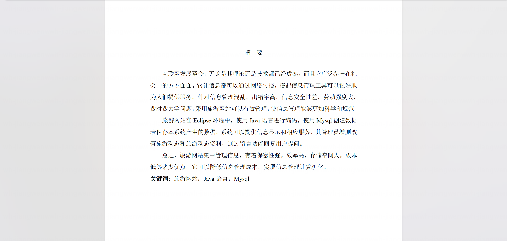
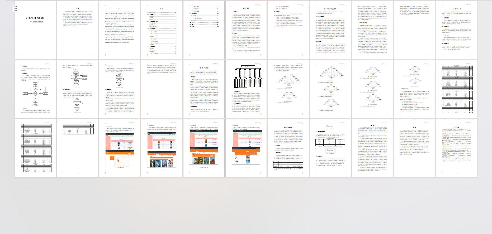
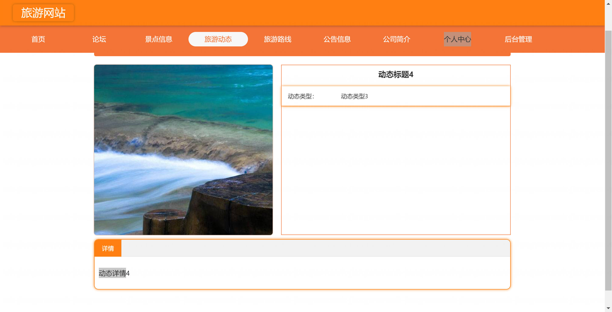
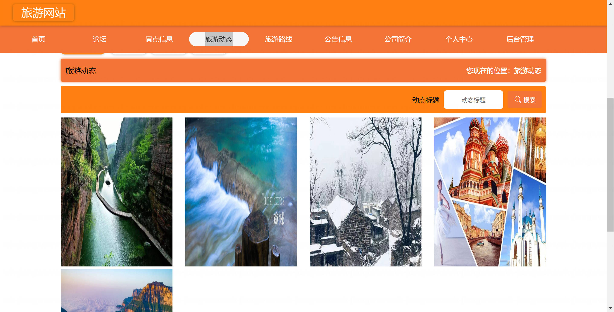
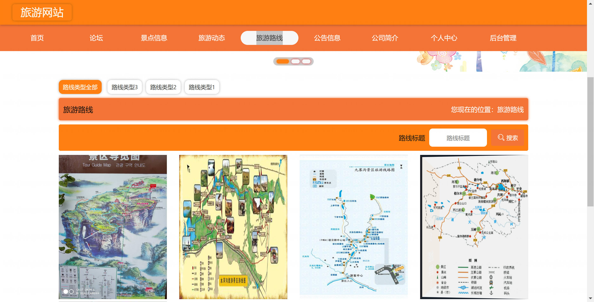
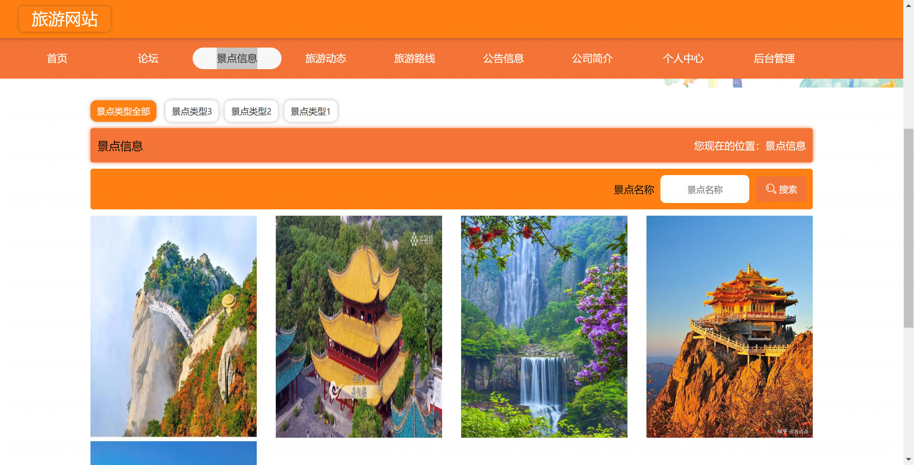
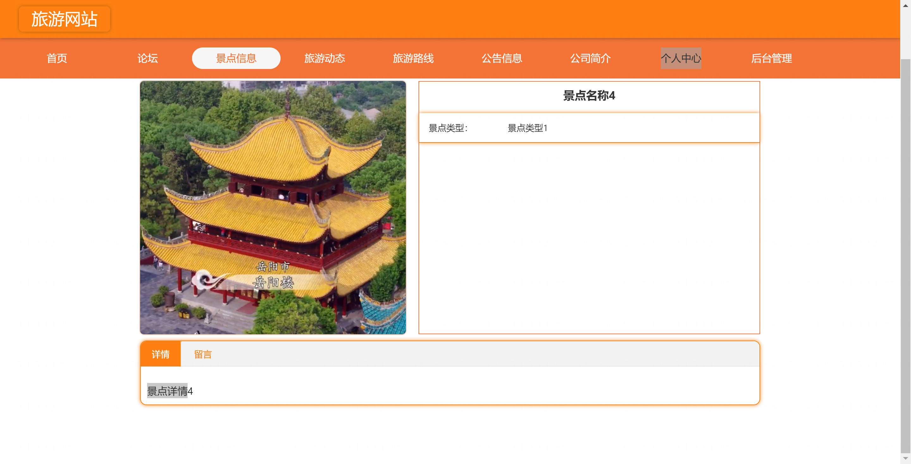
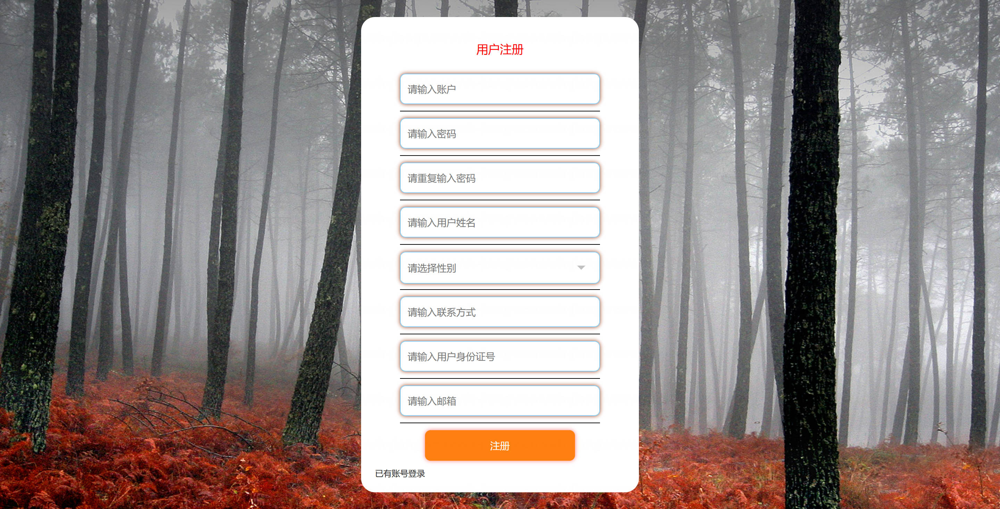
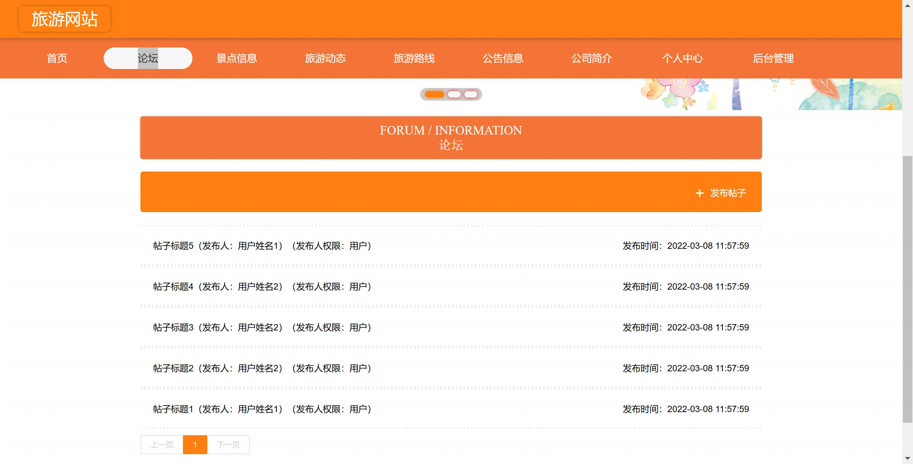
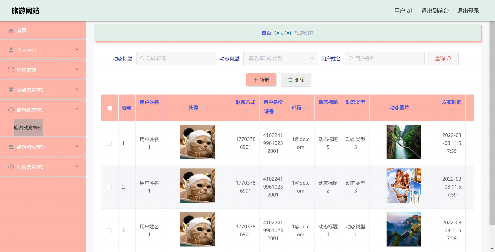

<h1 align="center">基于SpringBoot+Vue的旅游网站【带论文】</h1>

- <b>完整代码获取地址：从戎源码网 ([https://armycodes.com/](https://armycodes.com/))</b>
- <b>技术探讨、资料分享，请加QQ群：692619798</b>
- <b>作者微信：19941326836  QQ：952045282</b>
- <b>承接计算机毕业设计、Java毕业设计、Python毕业设计、深度学习、机器学习</b>
- <b>选题+开题报告+任务书+程序定制+安装调试+论文+答辩ppt 一条龙服务</b>
- <b>所有选题地址 ([https://github.com/Descartes007/allProject](https://github.com/Descartes007/allProject)) </b>

## 一、项目介绍

基于SpringBoot+Vue的旅游网站，系统角色为管理员、前台用户，主要功能如下
### 管理员：
- 基本操作：登录、修改密码、获取个人信息、修改个人信息、退出登录
- 用户管理（系统用户 ：筛选用户、查看用户详情、新增用户、修改用户、删除用户、重置密码、分页查询
- 前台用户管理：筛选用户、查看详情、新增用户（默认初始密码）、修改用户（含头像、联系方式等）、逻辑删除/批量删除、分页查询、重置密码
- 景点管理：筛选景点、获取景点列表、查看景点详情、新增景点信息、修改景点信息、删除景点信息、支持图片上传
- 景点留言管理：获取留言列表、筛选留言、查看留言详情、删除留言
- 旅游路线管理：筛选路线、获取路线列表、查看路线详情、新增路线、修改路线、删除路线
- 旅游动态管理：筛选动态、获取动态列表、查看动态详情、发布动态、修改动态、删除动态
- 新闻资讯管理：筛选资讯、获取资讯列表、查看资讯详情、发布资讯、修改资讯、删除资讯
- 论坛管理：筛选帖子、获取帖子列表、查看帖子详情、发布/编辑帖子、删除帖子、基于字典的状态管理
- 搜索记录管理：获取搜索记录列表、筛选记录、查看记录详情、删除记录
### 前台用户：
- 基本操作：注册、登录、获取个人信息、修改个人信息、修改密码、退出登录
- 景点浏览与留言：浏览/筛选景点、查看景点详情、发布景点留言、查看留言
- 旅游路线：浏览/筛选路线、查看路线详情
- 旅游动态：浏览/筛选动态、查看动态详情
- 新闻资讯：浏览资讯、查看资讯详情
- 论坛社区：查看帖子、发帖/编辑自己的帖子、查看帖子详情
- 搜索与记录：关键词搜索、查看个人搜索记录（受限于记录策略）

## 二、项目技术

- 编程语言：Java
- 项目架构：B/S 架构
- 前端技术：Vue 2、Element-UI、Vue Router、Axios、Quill 富文本（vue-quill-editor）
- 后端技术：Spring Boot 2.2、Spring MVC、MyBatis、MyBatis-Plus、MySQL、Fastjson、Hutool

## 三、运行环境

- JDK版本：1.8及以上都可以
- 操作系统：Windows7/10、MacOS
- 开发工具：IDEA、Ecplise、MyEclipse都可以

## 四、数据库配置文件

- npm版本：6.14.13及以上都可以
- Redis版本：3.2.100及以上都可以
- 文件名：application.yml
- 编码类型：utf8

## 论文截图

## 系统截图

